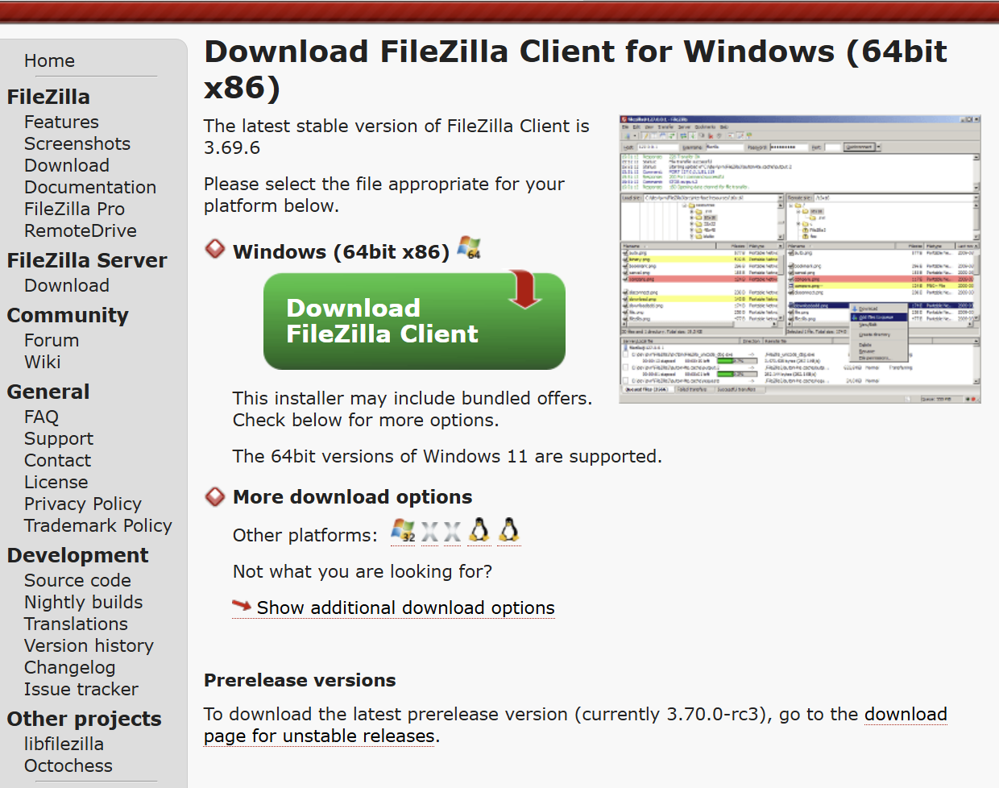
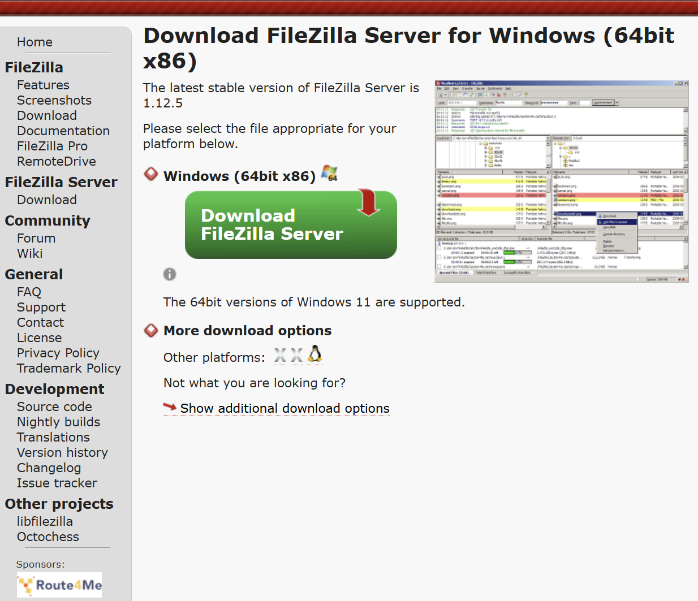

<h1>File Management</h1>
<h3>by Kyle Mullen</h3>
<h4>Mar 24, 2026</h4>

 

When we live in a world as data collected as ours, it is challenging and important to use something to manage your files. Unfortunately, the majority of people make files or folders from long ago and they sometimes get corrupted in trying to delete some files. Ideally, folders would simply be a collection of files based on the <strong>usability</strong> of each file that was important in each folder. While folders are supposed to be known by us, they aren't designed to be <strong>memorable</strong>. If the folders were memorable, we could easily remember every file or folder that was created years ago. Although, there are some people that do remember their folders which can contain important information. I know this fact because I was this person trying to keep up with my folder inventory. I used to know all of my folders and files because they were for school and for important data for my everyday life. If my computer got breached, then they would have access to all of my files. That is, until I started using a file manager.

Today, I know all of my files that have on my computer and it knows what files are in my personal and work computer. Whenever I need to have a specific file, it connects to a different network for me and it generates all of my files on my other network. I searched for "Filezilla" in the hopes that I can save and transfer files in this open-source platform.

Just then I was happy, and I searched up Filezilla to find a download link. So far it had a lot of actions that I was comfortable with and there was familiarity that I felt during the download link search. This site gave me a clear path to download Filezilla, using bright colors and large font.

It was followed by two paths that I stumbled my first challenge, choosing to download the client side or the server side

