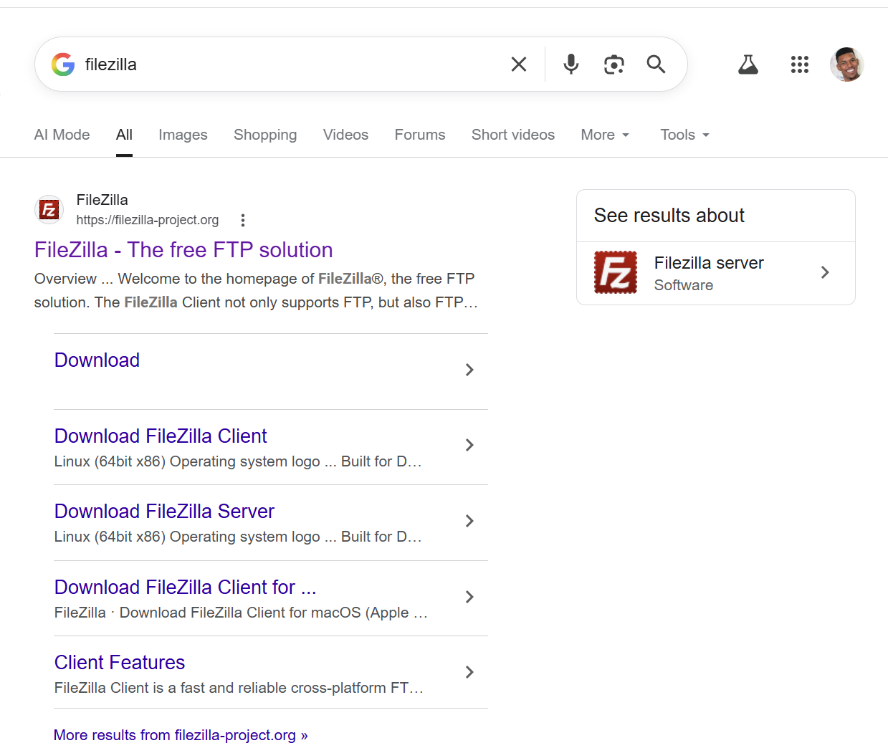
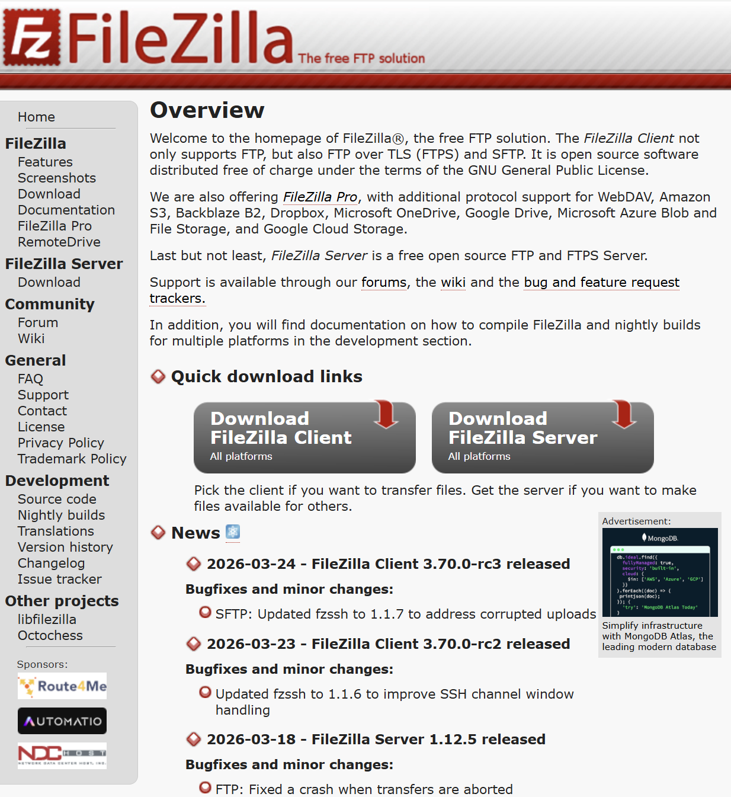
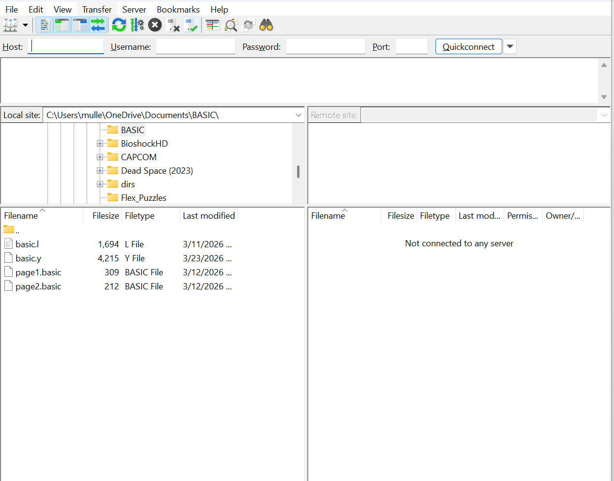
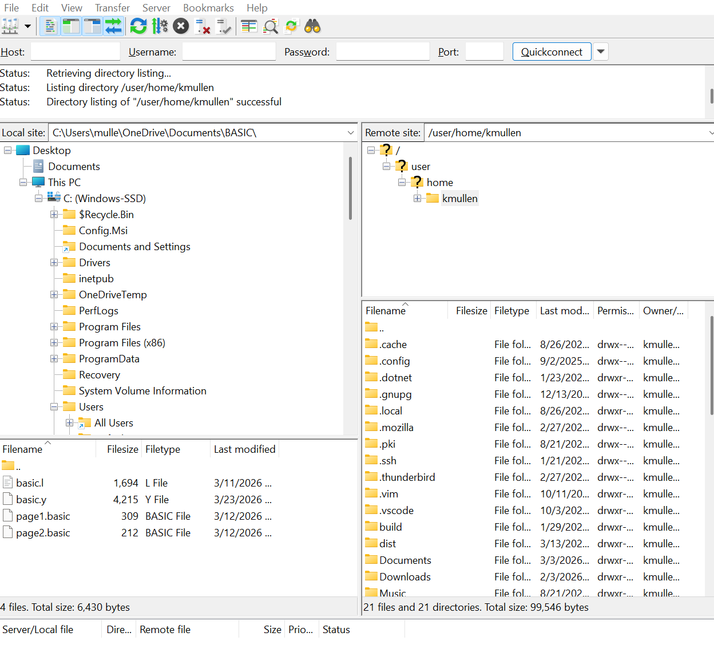

<h1>File Management</h1>
<h3>by Kyle Mullen</h3>
<h4>Mar 24, 2026</h4>

 

When we live in a world as data collected as ours, it is challenging and important to use something to manage your files. Unfortunately, the majority of people make files or folders from long ago and they sometimes get corrupted in trying to delete some files. Ideally, folders would simply be a collection of files based on the <strong>usability</strong> of each file that was important in each folder. While folders are supposed to be known by us, they aren't designed to be <strong>memorable</strong>. If the folders were memorable, we could easily remember every file or folder that was created years ago. Although, there are some people that do remember their folders which can contain important information. I know this fact because I was this person trying to keep up with my folder inventory. I used to know all of my folders and files because they were for school and for important data for my everyday life. If my computer got breached, then they would have access to all of my files. That is, until I started using a file manager.

Today, I know all of my files that have on my computer and it knows what files are in my personal and work computer. Whenever I need to have a specific file, it connects to a different network for me and it generates all of my files on my other network. I searched for "Filezilla" in the hopes that I can save and transfer files in this open-source platform.

Just then I was happy, and I searched up Filezilla to find a download link. So far it had a lot of actions that I was comfortable with and there was familiarity that I felt during the download link search. This site gave me a clear path to download Filezilla, using bright colors and large font. 

When I was going through the Download links for either the client side and the server side, I was confused in what to download because it lacked the instuctions for new users trying to download this software to their computer. After I figured out what to do, I downloaded the client side to my system because it had the best results for the user since they can use their app more effectively rather than trying to use the server side for their app. 

After all of the confusing downloads I had to do for this app, I figured out how to download this app which made it very simple in trying to install it and to use it to its full ability. After I downloaded the app, I tested out its <strong>Usability</strong> and <strong>Consistent</strong> features for this app and I figure out that I can connect to my other network where my other folders are and I was able to find out how much folders I had in my other network

When I was able to connect to my other network, I found out my sizes for each folder that contained all of my files and what locations my files were in which was a big help for me as the user. As I was browsing through the app, there was some features that had description in what to do when you want to connect to another network and what network was used to connect to the network. However, there was some features that wouldn't make sense for the user like the tabs up top of the app would be confusing for the user since there are pictures that would let the user know what to do, but there isn't a descriptive instruction in how to use that feature. Overall, I thought that this app had some good features that would make the user have a good experience in Filezilla and there should be some descriptive instructions in trying to learn how to use Filezilla so they can have a good experience with the app.

